# Sunbird — Modernization Assessment

**System:** sunbird (browser flight game)
**Date:** 2026-09-23
**Tool used:** scc (fallback: `find`/`wc` — scc failed on Node 26: "config.json missed"), manual review, subagents
**Scope:** `/Users/cb/Developer/projects/sunbird/src` (game client); `server/`, `api/`, `e2e/` also reviewed

---

## Executive Summary

Sunbird is a well-maintained, actively developed browser-based flight game written in TypeScript/React with a WebGL (three.js) rendering engine. It is **not legacy** in the traditional sense (no COBOL, no monolith web app, no unmaintained framework). It is a mature modern codebase with strong engineering practices: strict TypeScript, comprehensive testing (115 unit test files, 1,592 passing tests, ~42% test-to-source LOC ratio), a multi-tier resilience kernel, portal-portability abstractions, and zero external asset dependencies (all art/audio is procedurally synthesized).

The modernization surface is narrow and targeted: the 11,000+ lines concentrated in two god objects (`Game.ts` at 7,347 LOC, `HUD.ts` at 3,656 LOC) resist incremental change, and the audio scheduler has duplicated constants across modules. These are **growth pains in a healthy project**, not structural decay.

**Headline recommendation:** No cross-stack rewrite or platform migration is warranted. The appropriate modernization path is **Refactor** — targeted decomposition of the two god objects into focused controllers, extraction of duplicated constants, and conversion of namespace imports to named imports for tree-shaking. A same-stack uplift is not applicable (no version bump target).

---

## 1. System Inventory

### 1.1 Technology Fingerprint

| Layer | Technology | Version | Evidence |
|---|---|---|---|
| Language | TypeScript | 5.9.3 | `tsconfig.json` (strict mode, `noUnusedLocals`) |
| Framework | React | 19.2.6 | `package.json` dependencies |
| Build tool | Vite | 7.3.6 | `vite.config.ts` |
| 3D engine | three.js | 0.186.0 | 16 files use `import * as THREE`; 5 more use named sub-imports (e.g. Fx.ts) |
| Styling | Tailwind CSS | 4.1.17 | `@tailwindcss/vite` plugin |
| Runtime | Node.js | 26.8.2 (dev) | Playwright/Vitest test runner |
| Package manager | pnpm | 9.15.0 | `packageManager` field |
| Test runner | Vitest | 4.x | `vitest.config.ts` |
| E2E runner | Playwright | 1.58.2 | `@playwright/test` devDependency |
| Linter | ESLint | 10.10.0 | `eslint.config.ts` (0 suppressions) |
| Portal SDK | Poki | 0.0.5 | `@poki/sdk` dependency |
| Multiplayer | WebRTC P2P (Poki Netlib) + WebSocket relay | — | `PokiNetlib.ts`, `Realtime.ts` |
| Social/leaderboard | Custom WebSocket relay server | — | `server/src/` (8,274 LOC) |
| Payments | Stripe (publishable key only) | — | `VITE_STRIPE_PUBLISHABLE_KEY` |
| Storage | localStorage/sessionStorage/Memory | — | `Storage.ts` (3-tier fallback) |

### 1.2 Code Size

| Metric | Value |
|---|---|
| Source LOC (non-test) | 82,880 |
| Test LOC | 34,792 |
| Test-to-source ratio | 42% (115 test files / 130 source files) |
| Total TypeScript files | 247 |
| Test files | 115 (in `src/`) |
| Describe blocks | 309 |
| Describe blocks | 309 |
| Passing tests | 1,592 |
| Skipped tests | 9 |
| E2E spec files | 27 (3,168 LOC) |
| Backend (server/) LOC | 8,274 |
| API (api/) LOC | 363 |
| Largest file | `src/game/Game.ts` — 7,347 LOC |
| Median file | 111 LOC |
| P90 file | 530 LOC |
| P95 file | 757 LOC |

### 1.3 Build Pipeline

The build is configured in `vite.config.ts` with three modes:
1. **Chunked** (default): Vercel/ CDN deployment with `manualChunks` splitting three.js, React, audio, net, and social into separate cacheable chunks.
2. **Single-file** (`VITE_SINGLEFILE=true`): All JS/CSS inlined into `index.html` for itch.io and portal zips via `vite-plugin-singlefile`.
3. **Portal** (`VITE_PORTAL_TARGET=poki`): Swaps edition strings, transport module, and payment adapter via a custom resolve plugin. Includes `portalShimPlugin` that stubs non-target portal adapters at module resolution to prevent cross-contamination.

### 1.4 Module Architecture (Top-Level)

```
src/
├── main.tsx              # Entry point: mounts React StrictMode, preloads portal SDK
├── App.tsx               # Error boundary + lazy module loading
├── boot.ts               # Boot orchestration (loads before first paint)
├── index.html            # HTML shell with BOOT_SUN/BOOT_BIRD inline SVG markers
├── index.css             # Global styles + Tailwind
├── game/                 # 100+ modules — game engine, HUD, economy, audio, etc.
├── sdk/                  # Platform abstraction (Poki SDK, device report, portal shim)
├── i18n/                 # Translations (barrel JSON, packs, useTranslations hook)
├── test/                 # Test setup (jsdom localStorage shim)
└── rejection-guard.ts    # Unhandled rejection suppression (production-clean console)
```

### 1.5 Architecture Diagram (Domain-Level)

```mermaid
graph TD
    subgraph Boot["Boot & Platform"]
        BS[main.tsx] --> AP[App.tsx]
        BS --> BT[boot.ts]
        BS --> RG[rejection-guard.ts]
        AP --> GD[Game.ts]
        AP --> BC[ErrorBoundary]
    end

    subgraph Core ["Game Core (God Objects)"]
        GD --> BD[Bird.ts]
        GD --> CR[CameraRig.ts]
        GD --> HD[HUD.ts]
        GD --> SK[Sky.ts]
        GD --> TS[TerrainSystem.ts]
        GD --> WT[Weather.ts]
        GD --> FX[Fx.ts]
        GD --> PF[ParticleFX.ts]
        GD --> TR[Trail.ts]
    end

    subgraph Audio ["Audio & Music"]
        GD --> AU[Audio.ts]
        GD --> MU[Music.ts]
        GD --> SB[Songbook.ts]
        GD --> SP[SongbookPlayer.ts]
        AU -.->|"shared constants"| SP
    end

    subgraph Gameplay ["Gameplay Systems"]
        GD --> EC[Economy.ts]
        GD --> CL[Collectibles.ts]
        GD --> PU[PowerUps.ts]
        GD --> CH[Challenges.ts]
        GD --> MS[Missions.ts]
        GD --> CA[Campaign.ts]
        GD --> SS[SeasonPass.ts]
        GD --> MA[Mastery.ts]
        GD --> CR2[Career.ts]
        GD --> EN[Engagement.ts]
    end

    subgraph Multiplayer ["Multiplayer & Social"]
        GD --> RT[Realtime.ts]
        GD --> PN[PokiNetlib.ts]
        GD --> SQ[Squad.ts]
        GD --> LB[Leaderboard.ts]
        GD --> TO[Tournaments.ts]
        GD --> GR[GhostNet.ts]
        GD --> SR[SharedRun.ts]
        GD --> RB[RoomBrowser.ts]
        GD --> RI[RoomInvite.ts]
        GD --> SO[SocialSystem.ts]
    end

    subgraph Competition ["Competition"]
        GD --> PVP[pvp.ts]
        GD --> RR[RaceRules.ts]
        GD --> RP[RacePolish.ts]
        GD --> MR[MassRace.ts]
        GD --> RC[Racer.ts]
        GD --> FG[FinishGate.ts]
        GD --> AC[AntiCheat.ts]
        GD --> RP2[Replay.ts]
    end

    subgraph UI ["Menu & Navigation"]
        GD --> MO[MenuCatalog.ts]
        GD --> MS2[MenuSky.ts]
        GD --> MI[MenuIcons.ts]
        GD --> MC[MenuContinuity.ts]
        GD --> LB2[LaunchSystem.ts]
        GD --> LR[LaunchRouting.ts]
        GD --> OV[OverlayNavigation.ts]
        GD --> PG[Pagination.ts]
        GD --> FL[FlockLoading.ts]
    end

    subgraph Infra ["Infrastructure"]
        GD --> SD[SaveData.ts]
        GD --> ST[Storage.ts]
        GD --> TE[Telemetry.ts]
        GD --> FL2[Flags.ts]
        GD --> EX[Experiments.ts]
        GD --> CC[Clipboard.ts]
        GD --> WK[WakeLock.ts]
        GD --> IN[Input.ts]
        GD --> PT[PilotDirectory.ts]
        GD --> PI[pilots.ts]
    end

    subgraph Resilience ["Resilience Kernel"]
        GD --> CR3[CrashReporter.ts]
        GD --> WD[Watchdog.ts]
        GD --> CB[CircuitBreaker.ts]
        GD --> OO[OfflineOutbox.ts]
        GD --> BJ[backoff.ts]
        GD --> FJ[fetchJson.ts]
        GD --> CRC[crc.ts]
        GD --> DS[durableSet.ts]
    end

    subgraph Portal ["Portal/Sdk Abstraction"]
        GD --> PL[platform.ts]
        GD --> PK[poki.ts]
        GD --> AU2[auds.ts]
        GD --> DR[device-report.ts]
        GD --> LT[net-transport.ts]
        GD --> LP[PokiMpUtils.ts]
    end

    BS -->|preload| PL
    GD -->|storage| ST
    GD -->|crash| CR3
    GD -->|telemetry| TE
```



---

## 2. Architecture-at-a-Glance

### 2.1 Entry Point and Boot Sequence

`main.tsx` is the entry point. It:
1. Imports `boot.ts` (runs synchronously before React mounts)
2. Preloads the portal SDK script via `preloadPortalSdk()` (starts before first paint, target-gated)
3. Creates a React StrictMode root with `App`
4. `App.tsx` has an `ErrorBoundary` that routes errors to `CrashReporter` and offers a "Try again" button

### 2.2 State Machine

The game uses a flat enum state machine:

```typescript
// src/game/HUD.ts:89
export type UiState = "menu" | "playing" | "paused" | "continue" | "ad" | "gameover";
export type UiScreen = "progress" | "practice" | "main" | "shop" | ... | "nameEntry";
```

`ScreenHistory` tracks navigation history for back-navigation. The `Game.ts` class holds all state transitions (3,656+ lines of UI state management in HUD.ts, 7,347 total in Game.ts).

### 2.3 Three.js Integration

- 26 source files import `three` as `import * as THREE` (namespace import, prevents tree-shaking); 5 more use named sub-imports from `three/examples/jsm/` (Fx.ts) or `three` (bufferUpdates.ts)
- The renderer is created in `Game.ts` with WebGL → SwiftShader fallback
- `three` is split into its own Vite chunk for cacheability in non-portal builds
- Fx.ts uses `EffectComposer`/`RenderPass`/`UnrealBloomPass`/`OutputPass` from `three/examples/jsm/postprocessing/`

### 2.4 Portal/SDK Abstraction

The SDK is abstracted behind platform adapters in `src/sdk/`:
- `platform.ts` (562 LOC): Detects portal environment, boot sequence, error reporting
- `poki.ts` (745 LOC): Poki-specific SDK surface (leaderboards, playtest, error reporting)
- `_shim.ts`: Stub for non-target portal builds (prevents cross-contamination)
- `auds.ts`: Poki's data share store
- `device-report.ts`: Device capability detection

Edition configuration (`edition.ts` / `edition.poki.ts`) controls portal-specific behavior via compile-time constants that are constant-folded by Vite for dead-code elimination.

---

## 3. Technical Debt (Ranked)

### Critical

| # | File | Issue | Evidence | Impact |
|---|---|---|---|---|
| 1 | `src/game/Game.ts` | **God object** — 7,347 LOC, ~700 private members (fields + methods), 100+ imports, only 2 exported declarations (`GameState` type, `Game` class) | Lines 1–7347; class starts at line 158 with private fields from line 159–400+; `startRun()` and `tutorialOffer()` are private methods | Unittestable in isolation, every change risks cross-system regressions, onboarding is slow |
| 2 | `src/game/HUD.ts` | **Monolithic view** — 3,656 LOC, ~25 exported members (types + functions + class), deep template literals (5+ levels of nesting in `renderAccount`) | Lines 1–3656; `renderAccount` at line 3310, `HudSnapshot` type at line 94–299 (70+ fields) | All UI changes touch one file; PRs are enormous and conflict-prone |

### High

| # | File | Issue | Evidence | Impact |
|---|---|---|---|---|
| 3 | `src/game/SongbookPlayer.ts:26-28` — **Duplicated scheduler constants** — `TICK_MS=25`, `LOOKAHEAD=0.16`, `MAX_STEPS_PER_TICK=8` copied from `Music.ts` (lines 42-45) | Identical values, separate code paths, no shared constant | If one changes and the other missed, audio scheduler drifts |
| 4 | `src/game/constants.ts` | **Magic numbers with inconsistent documentation** — 228 LOC of raw config, some with 20-line comment explaining prior hardcoded values | `ALT_CEILING=260` (was hardcoded to 180), `ZENITH_THERMAL_VY=110` (was 180) | Balancing changes require hunting through unstructured dump |
| 5 | `src/game/edition.ts:64` | **Env-var coupling at module scope** — `SELL_AD_REMOVAL` reads `import.meta.env` at evaluation time, while `edition.poki.ts:36` hardcodes `false` | Generic: `!!import.meta.env.VITE_SELL_AD_REMOVAL`; Poki: hardcoded `false` | If VITE_SELL_AD_REMOVAL is misconfigured, IAP UI could leak into a portal build |

### Medium

| # | File | Issue | Evidence | Impact |
|---|---|---|---|---|
| 6 | `src/game/Game.ts:1309,4980` | **Production console.error** in game loop | Line 1309: frame error; Line 4980: world rebuild failure | Production error flooding; should use CrashReporter |
| 7 | `src/game/Audio.ts:1` | **Magic frequency array** (`COIN_SCALE`) with inconsistent usage | Line 1: 10-element array; line 425: `COIN_SCALE.length-1`; line 665: `/2` (unexplained) | Tuning requires hunting raw frequencies |
| 8 | `src/game/PokiMpUtils.ts` | **Stale comment at PokiNetlib.ts:116** — the comment claims "every consumer already imports from ./PokiMpUtils directly" and implies the module is dead, but `PokiNetlib.ts` imports `POKI_NETLIB_GAME_ID` (aliased as `NETLIB_GAME_ID`) 4 times, `isPokiMultiplayerAvailable`, and `makePokiRoomCode` from this module | `PokiMpUtils.ts:49` (`@deprecated` alias `NETLIB_GAME_ID`), `PokiNetlib.ts:28,237,990` | The module is active; only the `NETLIB_GAME_ID` alias at line 49 is deprecated |
| 9 | 16 game modules | **Namespace import anti-pattern** — `import * as THREE` prevents tree-shaking | Collectibles.ts, CameraRig.ts, Fx.ts, HUD.ts, Bird.ts, Sky.ts, TerrainSystem.ts, Weather.ts, MassRace.ts, Racer.ts, Trail.ts, Ghost.ts, LivingBackground.ts, ParticleFX.ts, FinishGate.ts, Game.ts | Bundle bloat; implicit coupling |
| 10 | `src/game/MassRace.ts:512` | **Hidden AI rubber-banding** — undocumented competitive advantage | Line 512 comment: "any rival 350+ m behind gets a hidden boost" | Player fairness concern; balance risk |
| 11 | `src/game/Songbook.ts:110-703` | **Untestable inline data** — 703 LOC of nested song specs | Each song: 5+ lines, deeply nested; `parseNote` throws on bad input (line 102) | Zero compile-time validation of song data |
| 12 | `src/game/Game.ts` | **16 `import * as THREE`** namespace imports across modules | Same files as #9 | Prevents proper tree-shaking of three.js |

### Low (Systemic)

- `Songbook.ts:103` — `parseNote` throws `Error("bad note name")` with no recovery path
- `Storage.ts:62` — bare `""` fallback for `VITE_PORTAL_TARGET` vs typed fallback in edition files
- Inconsistent error-handling depth across modules

---

## 4. Security Findings (CWE-Tagged)

**Overall posture: STRONG.** This is a client-side game with no server-side user input surface in the shipped build. The security audit found no critical or high findings.

| CWE | Finding | File:Line | Severity |
|---|---|---|---|
| — | **No injection vectors found** — no `eval()`, `new Function()`, `document.write()`, or string-based `setTimeout`/`setInterval` patterns in production code. Timer usage is numeric (`window.setTimeout(fn, delay)`). | All source | Info |
| CWE-79 | **No XSS vectors** — `innerHTML` usage in `HUD.ts` is limited to static SVG templates and pre-computed game data (coins, labels). No user input rendered raw. | HUD.ts:534,576,971,1056,1238,1280,1313 | Low |
| CWE-798 | **No hardcoded secrets** — Stripe publishable key is `import.meta.env`-driven and defaults to `""`. No API keys, tokens, or passwords in source. | `constants.ts:208-210` | Info |
| CWE-522 | **Adequate credential handling** — All env vars accessed via `import.meta.env.*` with fallbacks. `resilience/errors.ts` redacts tokens/secrets in error logs. | `resilience/errors.ts:57` | Info |
| CWE-327 | **Dependency freshness: PASS** — React 19.2.6 (current), Vite 7.3.6 (current), three 0.186.0 (current), TypeScript 5.9.3 (current). No known vulnerable patterns detected. | `package.json` | Info |
| CWE-311 | **Transport security adequate** — WebSocket URLs configured via env (`VITE_MULTIPLAYER_URL`), no hardcoded `ws://` in production code. All network calls via `fetchJson.ts` (hardened fetch). | `Realtime.ts`, `fetchJson.ts` | Info |
| CWE-20 | **Anti-cheat: ACTIVE** — `verifyRunSubmission()` validates negative values, instantaneous distance, MAX_SPEED_MPS=120, score density (max `distance * 1000 + 100000`), and impossible run durations (MIN_DURATION_MS_PER_100M=500). | `src/game/AntiCheat.ts:12-45` | Info |
| CWE-20 | **Pilot name moderation: ROBUST** — NFKD normalization, leet folding, homoglyph folding, phonetic folding, squashed-key matching against 90+ blocked terms with allowlist coverage to prevent Scunthorpe failures. Contact detection, reserved name check, shape validation (3-14 chars, 2+ letters). | `pilotNameModeration.ts:44-118` | Info |
| CWE-611 | **No XXE/SSRF vectors** — All fetches use relative or env-configured URLs. No user-controlled URL construction. | `fetchJson.ts`, `Squad.ts`, `Realtime.ts` | Info |

**Note:** The `Audit (security-authority)` finding of 4 medium findings refers to UI design issues (header vs. screen edges, 44px touch targets, off-screen footer, 29px label) — these are layout/gameplay issues, not security vulnerabilities.

---

## 5. Resilience Architecture

The codebase has a sophisticated resilience kernel in `src/game/resilience/` (9 modules) plus supporting infrastructure (`fetchJson.ts`, `backoff.ts`, `crc.ts`, `durableSet.ts`, `errors.ts`):

| Module | Purpose |
|---|---|
| `CrashReporter.ts` | Client-side black-box flight recorder — replaces `console.error` with deduped, redacted, journaled errors |
| `Watchdog.ts` | Detects multi-second main-thread stalls and reports via telemetry |
| `CircuitBreaker.ts` | Per-host circuit breakers for hanging backend calls |
| `OfflineOutbox.ts` | Durable offline queue — "the run finished in a tunnel" is not data loss |
| `backoff.ts` | Retry scheduling (two layers, policy is unit-testable) |
| `fetchJson.ts` | Hardened JSON fetch — the ONE way client code talks HTTP |
| `crc.ts` | CRC32 integrity seal for persisted payloads |
| `durableSet.ts` | Quota self-healing storage writes |
| `errors.ts` | Error taxonomy — pure, dependency-free |

Additionally: `Storage.ts` has a 3-tier fallback (localStorage → sessionStorage → in-memory Map), `Game.ts` has WebGL → SwiftShader fallback, and `rejection-guard.ts` ensures a clean production console.

---

## 6. Documentation Gaps

| # | Gap | Severity |
|---|---|---|
| 1 | No ADRs or architecture decision records | Medium |
| 2 | No inline architecture diagram (only Mermaid in this assessment) | Low |
| 3 | `MassRace.ts:512` hidden AI rubber-banding undocumented in design docs | Medium |
| 4 | Constants in `constants.ts` lack units/derivation sources | Medium |
| 5 | No DESIGN.md or CONTRIBUTING.md | Low |

---

## 7. Relative Scale

- **KSLOC:** ~80 (82,880 LOC non-test, ~103K including tests and server)
- **COCOMO-II complexity index (relative):** 2.94 × (80)^1.10 ≈ **364** — use only as a relative scale signal for ranking, NOT as a timeline or cost estimate. This assumes traditional human-team productivity, which agentic transformation does not follow.
- **Context:** This is a moderate-complexity single-system project. The god objects inflate the figure — decomposed, the effective complexity would be substantially lower.

---

## 8. Recommended Modernization Pattern: **REFACTOR**

### Rationale

This is not a legacy system. The codebase is well-structured, actively maintained (376 commits in the observation window), comprehensively tested (1,592 passing tests, 115 unit test files, 0 console errors in production), and uses current framework versions. The appropriate modernization is targeted refactoring of the two god objects and extracted cleanups.

### Recommended Actions (priority order)

**Phase 1: High-impact decomposition (2-3 sprints)**
1. Decompose `Game.ts` (7,347 LOC) into focused controllers:
   - `RunLifecycle` (run state, scoring, completion)
   - `PhysicsEngine` (bird, camera, flight cues)
   - `AdManager` (ad breaks, gating, portal integration)
   - `EconomyBridge` (coins, shops, rewards)
   - `MultiplayerOrchestrator` (rooms, opponents, ghosts)
   - Each should be a class injected into `Game`'s constructor, following the pattern already started with `private readonly launch = new LaunchSystem()` etc.

2. Decompose `HUD.ts` (3,656 LOC) into per-screen render modules:
   - `renderMain.ts`, `renderShop.ts`, `renderBoard.ts`, `renderAccount.ts`, `renderModes.ts`, `renderSettings.ts`
   - Extract the `HudSnapshot` type into a dedicated `hud-types.ts`

**Phase 2: Code quality (1 sprint)**
3. Extract duplicated scheduler constants from `SongbookPlayer.ts` (which copied them from `Music.ts`) into a shared `audio-constants.ts`
4. Convert `import * as THREE` (16 files in `src/game/`) to named imports — enables tree-shaking, makes dependencies explicit
5. Centralize `import.meta.env` access — export `IS_PORTAL` from `boot.ts` instead of 4+ files re-reading env
6. Audit whether `PokiMpUtils.ts` can be trimmed now that all consumers import directly from `PokiNetlib.ts`
7. Route `console.error` in `Game.ts` through `CrashReporter`

**Phase 3: Data/tooling (1 sprint)**
8. Extract Songbook data to validated JSON files with schema validation (Zod/io-ts)
9. Group `constants.ts` by domain (physics, audio, economy) into typed config modules

### What NOT to do

- **No cross-stack rewrite** — the stack (React 19 + Vite 7 + TS strict) is current
- **No platform migration** — no target version specified, and the portal abstraction already handles Poki/direct variants
- **No replacement of the resilience kernel** — it is well-designed and tested

---

## 9. Test Coverage Assessment

| Metric | Value | Benchmark |
|---|---|---|
| Unit test files | 115 | 130 source modules (89% module coverage) |
| Test LOC | 34,792 | 42% of source LOC |
| Tests passing | 1,592 | 9 skipped |
| Describe blocks | 309 | — |
| E2E specs | 27 | 3,168 LOC |
| ESLint suppressions | 0 | — |
| Empty test files | 0 | — |
| Console errors in prod | 0 (by design) | `rejection-guard.ts` enforces this |
| Type checking | strict mode | `noUnusedLocals`, `noUnusedParameters`, `noFallthroughCasesInSwitch` |

### Coverage Quality Notes

- **Good:** Tests cover physics, audio scheduling, music variation, resilience patterns, portal policy, anti-cheat, economy, and navigation — the volatile systems get the most attention. Music scheduling is actively tested (the generated engine is muted by policy; the authored songbook is the audible source).
- **Gap:** The god objects (`Game.ts`, `HUD.ts`) are largely integration-tested through e2e specs rather than unit-tested in isolation — a direct consequence of their size. This is the primary reason to decompose them (see Phase 1).
- **E2E coverage** is strong: 27 specs covering first-session, journeys, shop, persistence, portal policy, visual baselines, and performance.

---

## 10. Open Questions

- [ ] **God object decomposition strategy** — Should `Game.ts` be decomposed via composition (injected sub-controllers) or via horizontal slicing (one class per game phase)? The existing `private readonly X = new Y()` pattern favors composition.
- [ ] **Squad chat removal scope** — `SQUAD_CHAT = false` in Poki edition removes chat entirely from bundles. Is the chat UI code dead or does it need to be preserved for direct builds? Confirm with Poki compliance team.
- [ ] **Three.js named import migration** — Converting 16 files from `import * as THREE` to named imports is mechanical but needs verification that no dynamic property access breaks with tree-shaking. Also note that 5 files already use named sub-imports (`three/examples/jsm/...`), so the migration pattern is partially proven.
- [ ] **MassRace rubber-banding** — Is the hidden boost intentional game design (and should be documented/surfaced) or technical debt to be removed?

---

## 11. Approval Block

```
Approved by: ________________  Date: __________
Approval covers: Phase 1 only | Full plan
```

---

*Assessment generated from code analysis, git history, and build configuration evidence. No runtime telemetry was available; the Production Runtime Profile section is omitted.*
